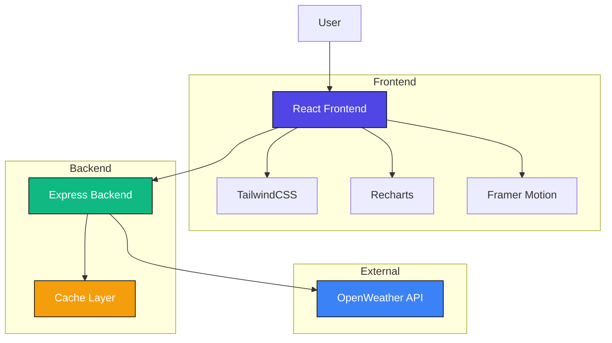

```mermaid
graph TB
    A[User] --> B[React Frontend]
    B --> C[Express Backend]
    C --> D[OpenWeather API]
    C --> E[Cache Layer]
    B --> F[TailwindCSS]
    B --> G[Recharts]
    B --> H[Framer Motion]
    
    subgraph Frontend
        B
        F
        G
        H
    end
    
    subgraph Backend
        C
        E
    end
    
    subgraph External
        D
    end
    
    style B fill:#4F46E5,stroke:#000,color:#fff
    style C fill:#10B981,stroke:#000,color:#fff
    style D fill:#3B82F6,stroke:#000,color:#fff
    style E fill:#F59E0B,stroke:#000,color:#fff
```